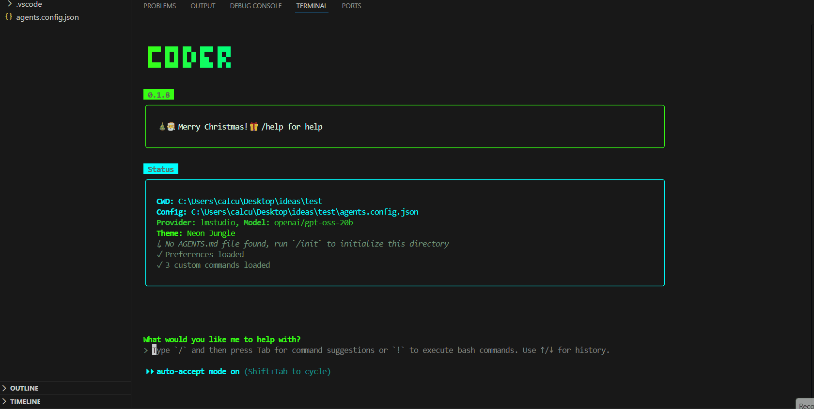
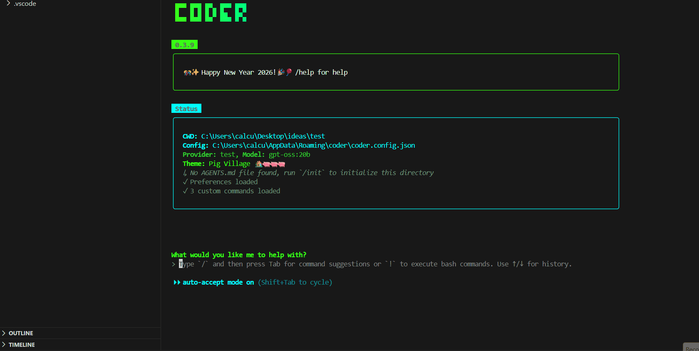

## gguf-coder

setup
```
python -m gguf_coder
```
enter your provider, model(s) and endpoint; edit it for different setting(s) if needed

## coder

install coder via npm
```
npm install -g @gguf/coder
```

update coder
```
npm update -g @gguf/coder
```

start coding
```
coder
```

see example below - vibe code a color picker, and edit it with coder afterwards:


the major difference is: when you ask Coder `what time is now` you will get the correct answer instead of when was this model being trained/deployed

